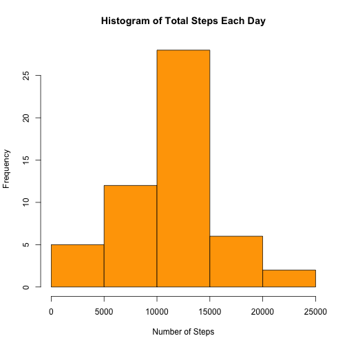

#Analysis of Activity Monitoring Data
###**Reproducible Research : Peer Assignment 1**   

*Kenneth Cheng*  

*Jan 14 2015*  

###Introduction

This document presents an analysis of data collected at 5 minute intervals throughout a day from a personal activity monitoring device. The data is available in the coursera website for Reproducible Research Peer Assignment 1 [Activity monitoring data](https://d396qusza40orc.cloudfront.net/repdata%2Fdata%2Factivity.zip).  The data consists of two months of data from an anonymous individual collected during the months of October and November 2012 and include the number of steps take in 5 minute intervals each day.

The report was produced using an R markdown document processed by knitr and then transformed into an HTML file. 

The analysis of the imputed data, where missing values are replaced by the mean steps of the interval with missing values, show that median number of steps per interval increased a bit as compared to the non-imputed data. Moreover the number of steps over the weekend appears to have more occurences of above 100 steps per 5-minute intervals than on weekdays. 

###Data

The data for this assignment was downloaded from the course website:

- **Dataset**: [Activity Monitoring data](https://d396qusza40orc.cloudfront.net/repdata%2Fdata%2Factivity.zip) [52K]

The variables included in this dataset are:

- **steps**: Number of steps taken in a 5-minute interval (missing values are coded as NA)

- **date**: The date on which the measurement was taken in YYYY-MM-DD format

- **interval**: Identifier for the 5-minute interval in which measurement was taken

This dataset is stored in a comma-separated-value (CSV) file and there are a total of 17,568 observations in this dataset.

###Loading and preprocessing the data

Load the data using read.csv()


```r
data <- read.csv("activity.csv")
```

###What is mean total number of steps taken per day?

For this part of the assignment, you can ignore the missing values in the dataset.

1. Make a histogram of the total number of steps taken each day


```r
steps_per_day <- aggregate(steps ~ date, data, sum)
hist(steps_per_day$steps, col="orange", main="Histogram of Total Steps Each Day", xlab="Number of Steps")
```

 

2. Calculate and report the mean and median total number of steps taken per day

```r
rmean <- mean(steps_per_day$steps)
rmedian <- median(steps_per_day$steps)
```

The mean number of steps taken per day is 1.0766189 &times; 10<sup>4</sup> and median number of steps taken per day is 10765.

###What is the average daily activity pattern?

1. Make a time series plot (i.e. type = "l") of the 5-minute interval (x-axis) 
and the average number of steps taken, averaged across all days (y-axis)

```r
steps_per_interval <- aggregate(steps ~ interval, data, mean)
plot(steps_per_interval$interval, steps_per_interval$steps, type="l", xlab="Interval", ylab="Number of Steps", 
     main="Average Number of Steps per Day per 5-minute Interval")
```

 

2. Which 5-minute interval, on average across all the days in the dataset, contains the maximum number of steps?

```r
max_interval <- steps_per_interval[which.max(steps_per_interval$steps),1]
max_steps <- round(max(steps_per_interval$steps))
```
The 835th 5-minute interval contains the maximum number of 206 steps.

###Inputing missing values

1. Calculate and report the total number of missing values in the dataset(ie the total number of rows with NAs)

```r
missing_vals <- sum(is.na(data$steps))
```
There are 2304 missing values in the dataset.

2. Devise a strategy for filling in all of the missing values in the dataset. The strategy does not need to be sophisticated. For example, you could use the mean/median for that day, or the mean for that 5-minute interval, etc.

Here we shall impute missing values by taking the average of the interval with missing values.

3. Create a new dataset that is equal to the original dataset but with the missing data filled in.

```r
data_i <- merge(data, steps_per_interval, by = "interval", suffixes = c("", ".y"))
nas <- is.na(data_i$steps)
data_i$steps[nas] <- data_i$steps.y[nas]
data_i <- data_i[, c(1:3)]
```

4. Make a histogram of the total number of steps taken each day.

```r
steps_per_day_i <- aggregate(steps ~ date, data_i, sum)
hist(steps_per_day_i$steps, col="orange", main="Histogram of Total Steps Each Day for Imputed Data", xlab="Number of Steps")
```

 

5. Calculate and report the mean and median total number of steps taken per day. 

```r
mean_i <- mean(steps_per_day_i$steps)
median_i <- median(steps_per_day_i$steps)
```
The mean is 1.0766189 &times; 10<sup>4</sup> and median is 1.0766189 &times; 10<sup>4</sup> for the total number of steps taken per day in the imputed data.

6. Do these values differ from the estimates from the first part of the assignment? 

```r
mean_diff <- mean_i - rmean
median_diff <- median_i - rmedian
```
The difference in the mean of imputed data from original data is 0.
The difference in the median of imputed data from original data is 1.1886792.

7. What is the impact of imputing missing data on the estimates of the total daily number of steps?

```r
total_diff <- sum(steps_per_day_i$steps) - sum(steps_per_day$steps)
```

The imputed data set resulted in 8.6129509 &times; 10<sup>4</sup> more total daily number of steps.

###Are there differences in activity patterns between weekdays and weekends?

1. Create a new factor variable in the dataset with two levels – “weekday” and “weekend” indicating whether a given date is a weekday or weekend day.

```r
weekdays <- c("Monday", "Tuesday", "Wednesday", "Thursday", "Friday")
data_i$dow = as.factor(ifelse(is.element(weekdays(as.Date(data_i$date)), weekdays), "weekday", "weekend"))

steps_per_interval_i <- aggregate(steps ~ interval + dow, data_i, mean)
```

2. Make a panel plot containing a time series plot (i.e. type = "l") of the 5-minute interval (x-axis) 
and the average number of steps taken, averaged across all weekday days or weekend days (y-axis). 
See the README file in the GitHub repository to see an example of what this plot should look like using simulated data.

```r
library(lattice)
xyplot(steps_per_interval_i$steps ~ steps_per_interval_i$interval|steps_per_interval_i$dow, type="l", 
       main="Average Steps Per Day by Interval", xlab="Interval", ylab="Number of Steps", layout=c(1,2))
```

 
